# The publication workflow

The complete cycle, from a settled publication back to a settled publication.

```mermaid
flowchart LR
  A[Settled publication] --> B[Fetch closure]
  B --> C[Local branch]
  C --> D[Derive tooling]
  D --> E[Change language, code and data]
  E --> F[Record semantic patches]
  F --> G[Acceptance under a constitution]
  G --> H[Package proposal]
  H --> I[Peers fetch closure]
  I --> J[Agreement and settlement]
  J --> K[Chain advances]
  K --> L[Fresh node reconstructs]
  L --> M[Studios reopen the state]
  M --> A
```



## Stages

| Stage | Mechanism | Foundation |
| --- | --- | --- |
| settled publication | `ReplayFromGenesis` | F7, F9 |
| fetch closure | `SyncStore`, digest addressed | F8 |
| local branch | `BranchFromCheckpoint` | F3, F7 |
| derive tooling | `DeriveToolchain` | F4 |
| change language | keyed grammar edit | F2, F3 |
| change code | semantic path edit on a term | F2 |
| change data | Meta declaration insert | F2, F3 |
| record patches | `RecordPatch` | F3 |
| commute independent patches | `TopoOrder` | F3 |
| explicit conflicts | `ReplayTolerant` | F3 |
| acceptance | `EvaluateAcceptance` | F5 |
| package proposal | `PublishableBranch` | F5, F7 |
| peers fetch closure | `ResumeTransfer` | F8 |
| settle transition | `ReplayFinalizedHistory` | F9 |
| chain advances | `ApplyTransition` | F7, F9 |
| fresh node reconstructs | `foundation reconstruct`, `foundation attest` | F6 |
| studios reopen | `RenderStudio` | F11 |

Replay the whole cycle:

```bash
sbt "runMain stratum.cli.Stratum derive --foundation foundations/F11 --goal '(call RoundTripStageNames)'"
sbt "runMain stratum.cli.Stratum transcript run fixtures/studio"
```

## What is anchored on the chain

A publication may anchor a repository branch frontier, an application root, a
foundation root, a language package, a data package or an archive root. Local
development activity is never anchored: only accepted publication events are.

## What travels between peers

Digest-addressed artifacts and canonical advertisements. Nothing else. A remote
patch arrives as a proposal and is never added to branch membership without a
local acceptance decision.

## What makes a transition settle

Semantic validity first, agreement second. A replica endorses only after the
proposed transition is valid under the selected foundation, and a transition
settles only with a certificate that binds the exact proposal digest and reaches
the constituted threshold.
